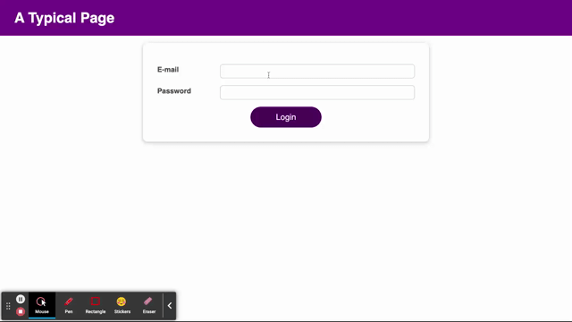

# Login page.

The login page and home screen template.

[Login page](https://login-page-plum.vercel.app)

### Stack:

* React

### Application functionality.

### Get started.

Clone the project

`git clone git@github.com:zakharovdm/login_page.git`

Set up the dependencies

`make install`